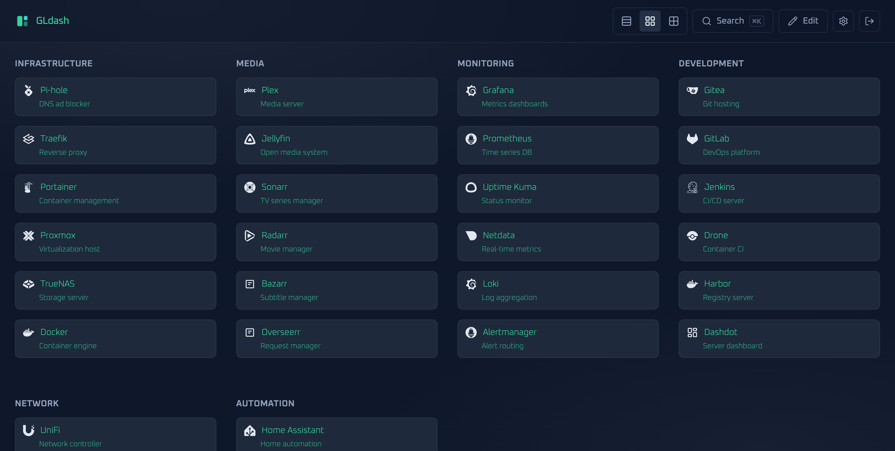
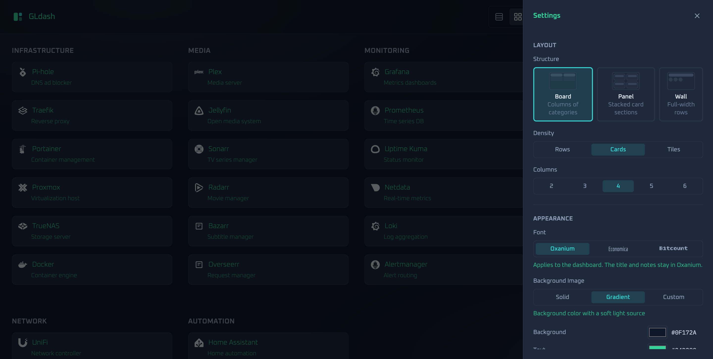
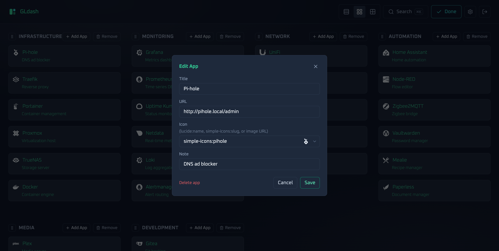
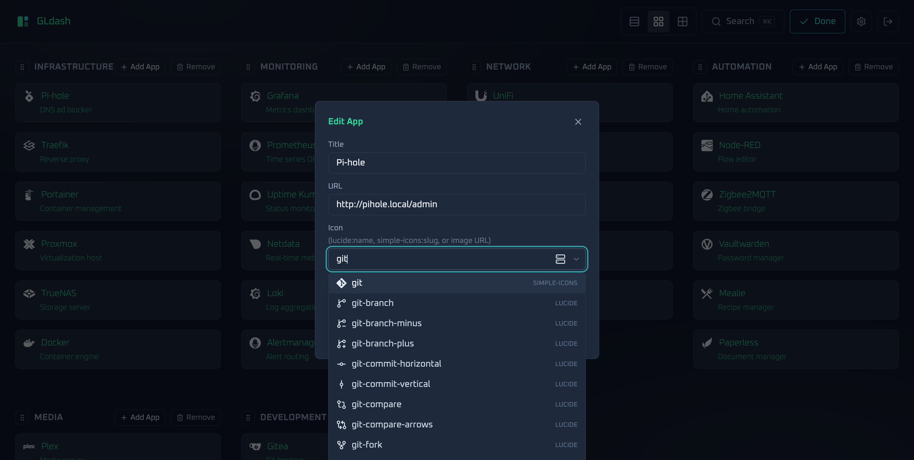
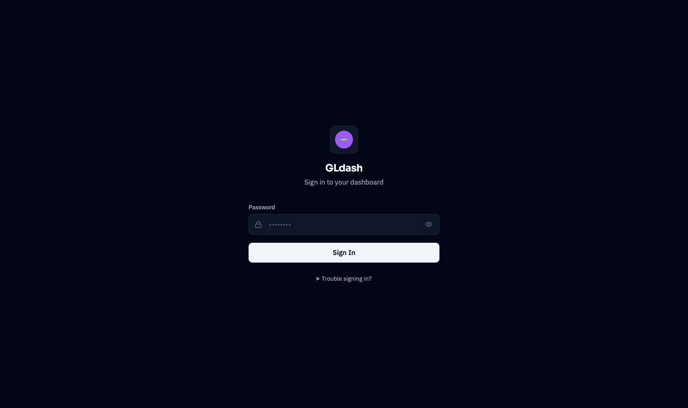

# GLdash

A **fast, elegant, and lightweight homelab dashboard and application launcher**. GLdash turns a single YAML file into a beautiful, installable dashboard for all your self-hosted services — with drag-and-drop organization, real-time theming, a spotlight quick-launcher, and a responsive set of views.

Built with **SvelteKit 5 (runes)**, **TypeScript (strict)**, **Tailwind CSS v4**, and **Zod**, designed to run anywhere: bare-metal Node, Docker, or a NAS box.

---

## 📸 Screenshots



<div align="center">

[](static/screenshots/settings.png)
[](static/screenshots/edit-app.png)

</div>

| Icon picker (autocomplete) | Login page |
| -------------------------- | ---------- |
|  |  |

---

## ✨ Features

### Dashboard & Layouts
- **Three layout modes** — switchable from the toolbar:
  - **Grid** — responsive card grid with an editable column count (2–6).
  - **Fluid** — auto-fitting flex/masonry layout that fills the width.
  - **Table/List** — dense rows for fast, at-a-glance scanning.
- **Categories** organize apps into labeled sections.
- **Edit Mode** — toggle editing, then:
  - **Drag-and-drop reordering** of cards within and across categories (`svelte-dnd-action`).
  - **Per-app edit modal** — title, URL, icon, and note.
  - Add / remove **apps and categories**.

### Theming & Background Image
- **Theme Customizer** — change background, text, and card colors **in real time**, persisted straight to `config.yaml`.
- **Background image** with three selectable modes (in Settings → Theme):
  - **Default** — ships with `config/default-bg.jpg` (edit or mount that file to change it; served via `/api/background/default`).
  - **Custom** — upload a JPEG/PNG/WebP (≤ 5 MB); stored on the server and served via `/api/background/image`, so it works in dev and the Node production build (*not* baked into the static manifest).
  - **Solid** — plain color + gradient overlay, no image.
- **Restore Default Styling** — one-click (with confirmation) reset of the theme colors and a return to the default background image; layout and column count are untouched.
- Subtle radial-gradient overlay keeps cards readable on any image.
- Clean neutral **slate/zinc** palette, discrete 1px borders, and 150 ms micro-interactions — no "AI slop" gradients or glassmorphism.

### Smart Icons
Icons resolve in priority order:
1. **Lucide** — e.g. `lucide:server` (rendered inline).
2. **Simple Icons** — e.g. `simple-icons:grafana`, served **server-side** from the `simple-icons` package via `GET /api/icons/simple-icons/[slug]` (keeps the large icon dataset out of the client bundle).
3. **Direct image URL** — any `http(s)://...` or local path.
4. **Automatic fallback** — domain favicon (`google.com/s2/favicons`).

### Security & Authentication
- **Single-admin password login** — the dashboard is locked behind a login page until you set an admin password (bcrypt-hashed, stored in `config.yaml`).
- **First-run setup** — on the very first visit (no password configured), the login page acts as a setup screen to create the admin password.
- **JWT sessions** — successful login issues a signed session cookie (`gldash_session`) valid for 72 hours; on the server side a random persistent secret is generated next to `config.yaml` (or use `JWT_SECRET`).
- **Change password** — from Settings, authenticated with the current password; sessions are refreshed on success.
- **Recovery** — forgot the password? Empty `auth.adminPasswordHash` in `config.yaml` and restart; the next visit prompts to set a new one.
- **Logout** — clears the session cookie.

### Productivity & PWA
- **Spotlight / Quick Search** — open with `Cmd/Ctrl + K`, keyboard-navigable, matched across title, note, and URL.
- **PWA** — installable on iOS/Android/desktop with offline app-shell caching (`@vite-pwa/sveltekit` + Workbox).

---

## 🧰 Tech Stack

| Layer       | Technology                                        |
| ----------- | ------------------------------------------------- |
| Framework   | SvelteKit 5 (runes) + Svelte 5                    |
| Language    | TypeScript (strict)                               |
| Styling     | Tailwind CSS v4 + Lucide icons (`@lucide/svelte`) |
| Icons       | `simple-icons` (server-served SVGs)               |
| Data/config | `js-yaml` (parsing/writing) + `zod` (validation)  |
| Drag & drop | `svelte-dnd-action`                               |
| Images      | `sharp` (background image processing)             |
| PWA         | `@vite-pwa/sveltekit`                             |
| Runtime     | Node.js (via `@sveltejs/adapter-node`)            |

---

## 🚀 Getting Started

### Local development

```sh
npm install
npm run dev -- --open
```

The dashboard reads/writes `./config/config.yaml` by default. Override the location with the `CONFIG_PATH` environment variable:

```sh
CONFIG_PATH=/path/to/config.yaml npm run dev
```

### Type checking & build

```sh
npm run check        # svelte-check (strict TypeScript)
npm run build        # production build (adapter-node)
npm run preview      # preview the production build
```

---

## 🐳 Docker

### Docker Compose (recommended)

```sh
docker compose up -d --build
```

This builds the **multi-stage Dockerfile** (`node:22-alpine`), exposes port `3000`, and mounts `./config` into the container so your dashboard configuration **and the default background image** (`config/default-bg.jpg`) persist across restarts. Both are read from the mounted volume at runtime, so editing them takes effect without a rebuild.

### Manual build

```sh
docker build -t gldash .
docker run -d \
  -p 3000:3000 \
  -v "$PWD/config:/app/config" \
  -e CONFIG_PATH=/app/config/config.yaml \
  gldash
```

### Environment variables

| Variable      | Description                                  | Default                 |
| ------------- | -------------------------------------------- | ----------------------- |
| `CONFIG_PATH` | Path to the dashboard's `config.yaml`.        | `./config/config.yaml`  |
| `PORT`        | HTTP port for the Node server.                | `3000`                  |
| `JWT_SECRET`  | JWT signing secret (sessions). When unset, a persistent random secret is generated and stored next to `config.yaml`. | auto-generated |
| `COOKIE_SECURE` | Set `true` to send the session cookie with `Secure` only (e.g. behind TLS). Leave unset on plain-HTTP LANs. | unset |

---

## 📄 Configuration Schema

All data is validated with **Zod** on every read and write. A minimal `config.yaml`:

```yaml
settings:
  layout: "grid"          # "grid" | "fluid" | "table"
  columns: 4              # integer, 2 to 6 (grid layout)
  theme:
    background: "#0f172a"
    textColor: "#f8fafc"
    cardBackground: "#1e293b"
    backgroundMode: "default"        # "default" | "custom" | "solid"
    backgroundImage: ""              # uploaded image URL, only used when custom

categories:
  - id: "infra-01"                # optional, auto-generated if omitted
    name: "Infraestrutura"
    apps:
      - id: "pihole-01"
        title: "Pi-hole"
        url: "http://192.168.1.10/admin"
        icon: "simple-icons:pihole"    # lucide:* | simple-icons:* | URL | fallback
        note: "DNS Primário da Rede"
```

The **default background** lives at `config/default-bg.jpg` — the same directory as `config.yaml` — and is served from there at request time, so replacing the file (or mounting a new one) updates the dashboard without a rebuild. When `backgroundMode` is `solid`, the image is ignored and the solid color + gradient overlay is used.

> **`auth` — the admin password block.** `config.yaml` also stores an
> `auth.adminPasswordHash` value (a bcrypt hash, never a literal password). It is
> kept **out of the dashboard schema above** so the hash is never sent to the
> client. An empty string means no password is set (first-run setup). See
> [Security & Authentication](#security--authentication).

### Icon resolution

| Format                   | Example                              | Renders as                          |
| ------------------------ | ------------------------------------ | ----------------------------------- |
| Lucide                   | `lucide:server`                      | Inline Lucide icon                  |
| Simple Icons (brand)     | `simple-icons:grafana`                | Server-side SVG (`/api/icons/...`)  |
| Direct URL / local path  | `https://…/icon.png` or `/icons/x`    | Rendered ``                    |
| *(none / unknown)*       | *(auto)*                             | Domain favicon (`google.com/s2/favicons`) |

---

## 🔌 API Reference

| Method   | Route                              | Description                                            |
| -------- | ---------------------------------- | ------------------------------------------------------ |
| `GET`    | `/api/config`                      | Returns the validated config as JSON.                  |
| `POST`   | `/api/config`                      | Validates with Zod and writes the config back to YAML. |
| `POST`   | `/api/background`                  | Uploads a background image (multipart field `image`).  |
| `GET`    | `/api/background/default`          | Serves the shipped default image (`config/default-bg.jpg`). |
| `GET`    | `/api/background/image`            | Serves the current custom (uploaded) background image. |
| `DELETE` | `/api/background`                  | Removes the uploaded background image.                |
| `GET`    | `/api/icons/simple-icons/<slug>`   | Serves a brand SVG by Simple Icons slug.               |
| `POST`   | `/api/auth/login`                  | Logs in (or performs first-run setup); body `{ password, confirm? }`. Sets the 72 h session cookie. |
| `POST`   | `/api/auth/logout`                 | Clears the session cookie.                            |
| `POST`   | `/api/auth/reset-password`         | Changes the password (requires session + current password). |

> All non-`/api/auth/*` and non-`/login` routes require a valid session; unauth
> API requests get `401`, pages redirect to `/login`.

---

## 🧱 Project Structure

```
src/
├── lib/
│   ├── assets/            # favicon.svg
│   ├── components/        # Toolbar, CategorySection, AppCard, AppIcon,
│   │                      # EditAppModal, SettingsDrawer, Spotlight, ConfirmDialog
│   ├── server/            # yaml.ts (config read/write), auth.ts (bcrypt/JWT), background.ts (image helpers)
│   ├── state/             # dashboard.svelte.ts (reactive global state)
│   ├── utils/             # icons.ts (icon resolution)
│   ├── types.ts           # Zod schemas + exported TS types (AuthConfigSchema is server-only)
│   └── index.ts           # barrel export for the $lib alias
└── routes/
    ├── +layout.svelte     # root layout (loads Tailwind + favicon)
    ├── hooks.server.ts    # global auth gate (redirects to /login, 401 for APIs)
    ├── +page.server.ts    # server load: reads config
    ├── +page.svelte       # dashboard shell (background styling)
    ├── login/             # login / first-run setup page
    ├── layout.css         # Tailwind v4 import + CSS custom properties
    └── api/
        ├── config/        # GET/POST config
        ├── background/    # POST upload, DELETE
        │   ├── default/   # GET serve config/default-bg.jpg
        │   └── image/     # GET serve uploaded image
        ├── auth/          # login, logout, reset-password
        └── icons/simple-icons/[slug]/   # server-side brand SVGs
```

---

## 🗺️ Roadmap

- **Phase 2 — Traefik / Docker auto-discovery** — optional read access to `/var/run/docker.sock` or the Traefik REST API, with a "Discovered Services" drawer inside Edit Mode to one-click populate the config.
- **Phase 3 — Update tracker** — background checks for GitHub Releases and Docker Hub tags; discrete **"Update Available"** badges on cards.

---

## 📚 Documentation

- [`docs/CHANGELOG.md`](docs/CHANGELOG.md) — versioned release notes.
- [`docs/ARCHITECTURE.md`](docs/ARCHITECTURE.md) — system design, data flow, and module map.